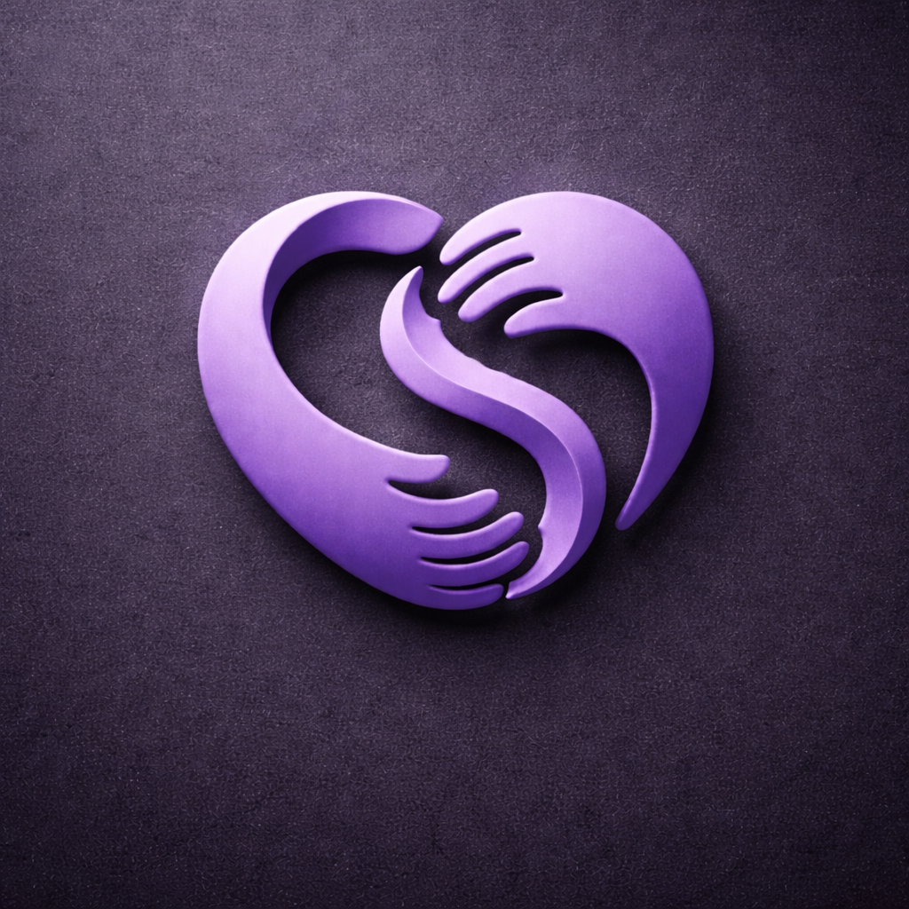
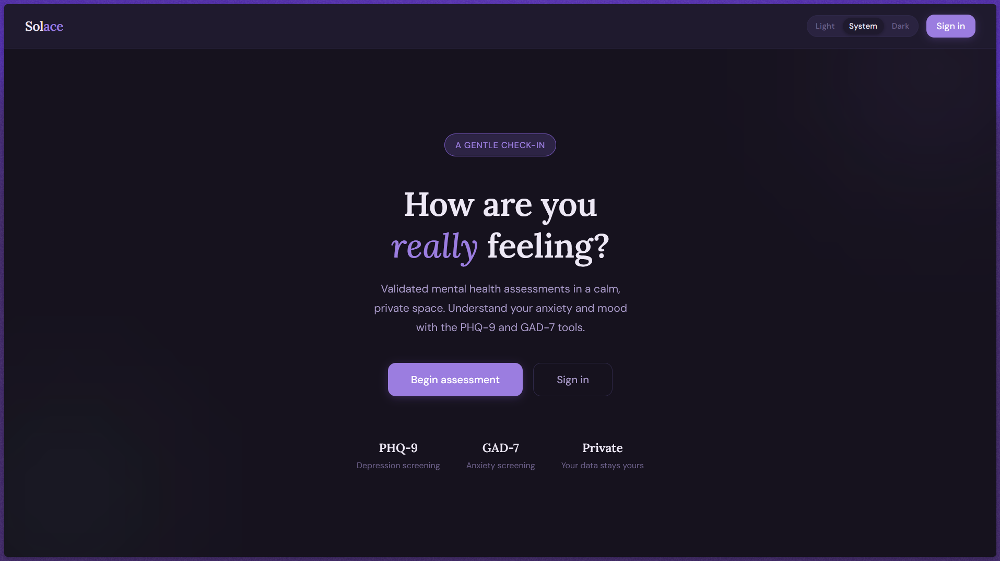
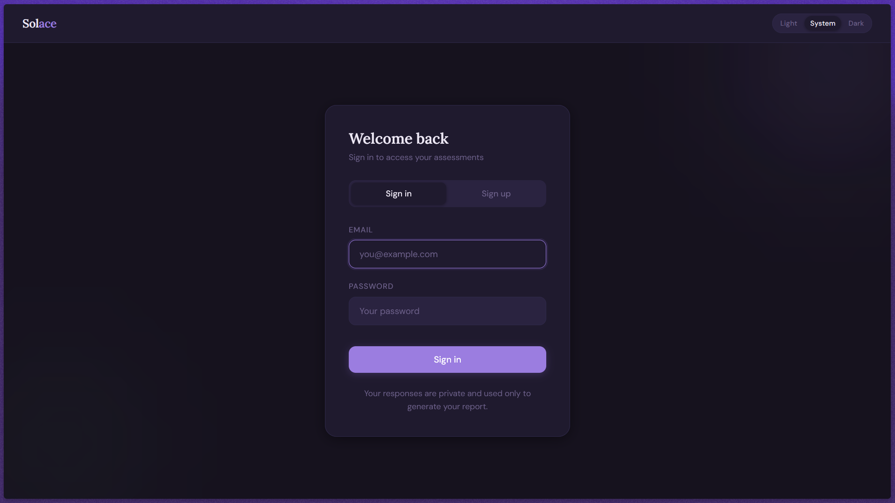
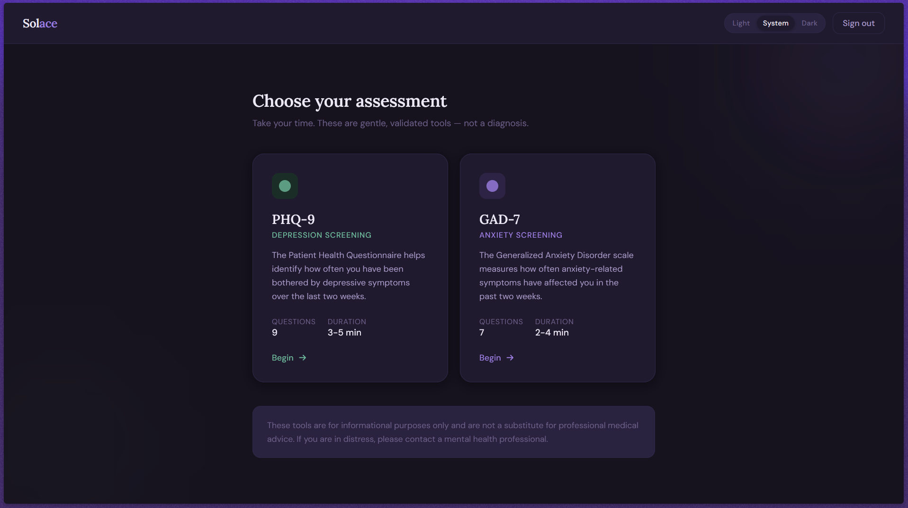
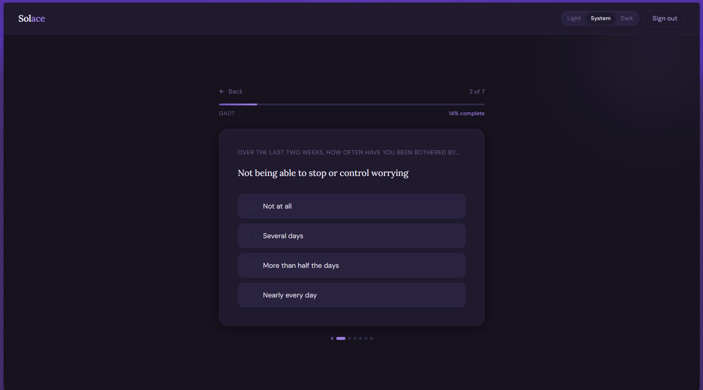
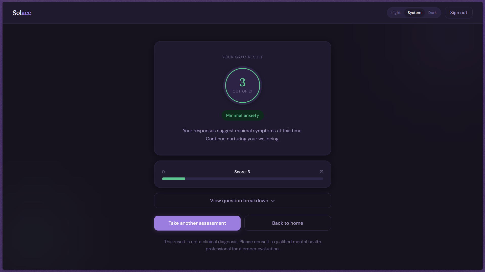

<p align="center">
  
</p>

<h1 align="center">Solace</h1>

<p align="center">
[](https://github.com/saunak-ramiya-sebasan/solace)
[](https://github.com/SAUNAK-RAMIYA-SEBASAN/solace/blob/main/docker-compose.yml)
[](https://github.com/SAUNAK-RAMIYA-SEBASAN/solace/tree/main/frontend)
[](https://github.com/SAUNAK-RAMIYA-SEBASAN/solace/tree/main/backend)
[]()
[]()
</p>

---

## Overview

Solace is a web-based mental health assessment platform that enables users to evaluate their mental well-being using standardized screening tools — PHQ-9 (depression) and GAD-7 (anxiety), based on WHO guidelines.

Users can securely sign up, take assessments, and receive a detailed report via email, including a downloadable PDF.

---

## Problem It Solves

Mental health issues often go unnoticed due to lack of accessible, stigma-free tools. Solace provides a simple and private way for users to perform self-assessment using clinically recognized questionnaires and receive structured feedback instantly.

---

## Use Case

* Self-assessment of mental health conditions
* Early detection of depression and anxiety symptoms
* Quick screening tool for students, professionals, and general users

---

## Tech Stack

### Frontend

* React (Vite)
* Bun
* Nginx (reverse proxy and static serving)

### Backend

* FastAPI
* uv

### Database

* PostgreSQL

### DevOps

* Docker
* Docker Compose

---

## Features

* Secure authentication using JWT and OAuth2
* User registration and login
* PHQ-9 and GAD-7 assessments
* Automated evaluation of test responses
* Email delivery of results
* PDF report generation and attachment
* Fully containerized deployment

---

## Architecture

Solace follows a three-tier (layered) architecture:

### Presentation Layer

* React + Vite frontend
* Served via Nginx (reverse proxy and static hosting)

### Application Layer

* FastAPI backend
* Handles business logic, authentication, and APIs

### Data Layer

* PostgreSQL database
* Stores user data and assessment results

---

## Project Structure

```
solace/
│
├── frontend/        # React + Vite (served via Nginx)
├── backend/         # FastAPI application
├── docker-compose.yml
└── README.md
```

---

## Setup and Run (Docker)

### Prerequisites

* Docker Desktop installed
* Docker running

---

### Steps

1. Clone the repository

```bash
git clone https://github.com/SAUNAK-RAMIYA-SEBASAN/solace.git
cd solace
```

2. Create environment file

Create a `.env` file inside the `backend/` folder:

```env
# DATABASE
DATABASE_URL=postgresql://postgres:root@db:5432/mental_health_db

# AUTH
SECRET_KEY="your_secret_key"
ACCESS_TOKEN_EXPIRE_MINUTES=1440

# EMAIL CONFIG
SMTP_HOST=smtp.gmail.com
SMTP_PORT=587
SMTP_USER=your_email@gmail.com
SMTP_PASSWORD="your_16_digit_app_password"
```

3. Run the application

```bash
docker compose build
docker compose down
docker compose 
```

---

## Access

* Frontend: [http://localhost](http://localhost)
* Backend API: [http://localhost:8000](http://localhost:8000)

---

## Docker Services

* db: PostgreSQL database
* backend: FastAPI service
* frontend: React app served via Nginx

---

## Email Functionality

The system uses SMTP to send:

* Assessment results
* PDF report attachment

Note: For Gmail, use an App Password instead of your account password.

---

## Screenshots






